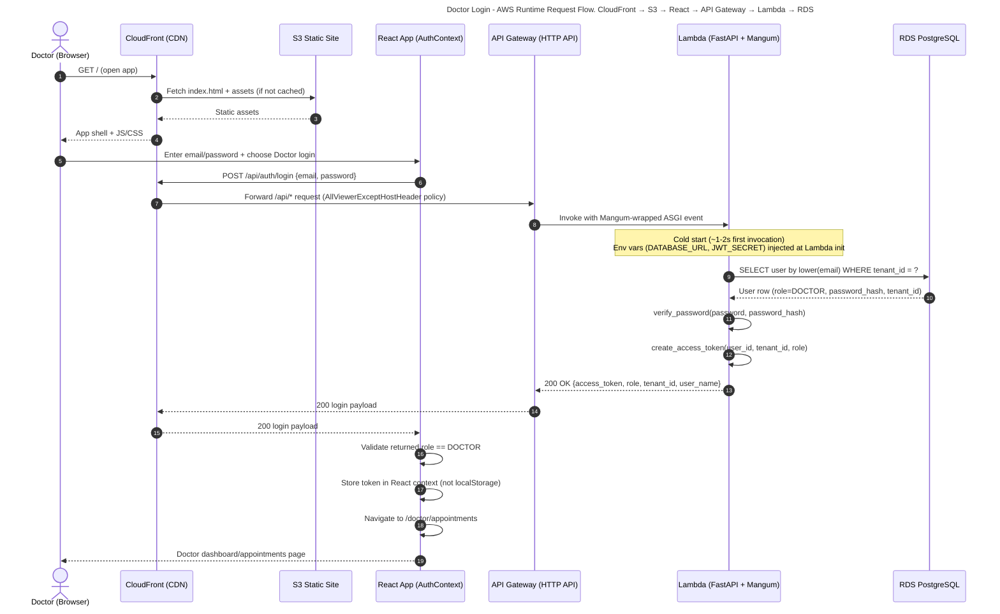

# Doctor Login Control Flow (AWS Deployment)

## Purpose
This document captures the runtime sequence for a **doctor login** in the AWS deployment created for this project.

## Scope and assumptions
- Frontend is served from **S3 + CloudFront**.
- Backend runs as an **AWS Lambda function** exposed via **API Gateway HTTP API**.
- CloudFront routes `/api/*` requests to API Gateway; all other routes serve the React app from S3.
- Backend receives `DATABASE_URL`, `JWT_SECRET`, and `CORS_ORIGINS` from **Lambda environment variables** (set at deploy time via AWS SAM parameter overrides).
- PostgreSQL runs on **RDS** and is reachable from the Lambda function's VPC security group.
- Frontend uses `VITE_API_BASE_URL` to call the backend login endpoint (in production this is not needed — CloudFront handles routing via the `/api/*` behavior).

## Primary sequence (successful doctor login)

## Detailed step-by-step breakdown

1. **Frontend delivery path**
   1. Browser requests the app via CloudFront.
   2. CloudFront serves cached files or fetches from S3 origin (default cache behavior).
   3. Browser loads React bundle and initializes auth context.

2. **Doctor submits credentials**
   1. React login handler sends `POST /api/auth/login` via CloudFront (relative path — no hardcoded API URL needed in production).
   2. Request carries JSON body with `email` and `password`.

3. **Edge and compute routing**
   1. CloudFront matches the `/api/*` cache behavior and forwards to the API Gateway origin.
   2. The `AllViewerExceptHostHeader` origin request policy is applied — this strips the viewer's `Host` header so API Gateway receives its own hostname, not the CloudFront domain.
   3. API Gateway HTTP API invokes the Lambda function synchronously.
   4. Mangum adapter translates the API Gateway event into an ASGI request that FastAPI handles.

4. **Backend authentication logic**
   1. FastAPI `TenantContextMiddleware` recognises `/api/auth/login` as a public path and skips JWT validation.
   2. Login route lowercases email and fetches the user from RDS.
   3. Password hash verification is performed (PBKDF2-SHA256, 120,000 iterations).
   4. On success, JWT access token is generated (HS256, 30-minute TTL) with `user_id`, `tenant_id`, and `role` claims.
   5. Response includes role and tenant metadata used by the frontend.

5. **Frontend role safety check**
   1. Client verifies the API-returned role matches the selected login target (`DOCTOR`).
   2. On match, token is stored in React context (not `localStorage` — avoids XSS token theft) and the doctor route is opened.
   3. On mismatch, login is rejected with a generic invalid-credentials message.

## Error branches (high-level)

### A) Invalid credentials
- Backend returns `401 Invalid credentials`.
- Frontend shows authentication error and remains on login screen.

### B) Role mismatch (security gate in UI)
- Backend login succeeds but role is not `DOCTOR` while the doctor tab is selected.
- Frontend blocks session establishment and shows generic invalid credentials message.

### C) CORS mismatch
- If the CloudFront origin is not present in `CORS_ORIGINS` (Lambda env var), the browser blocks the preflight response.
- User sees a network/CORS error at login.

### D) Lambda or DB unavailable
- Lambda cold start failure or unhandled exception → API Gateway returns 5xx.
- RDS unreachable (security group misconfiguration, DB down) → FastAPI returns `503 Service Unavailable` from the health check path; login returns 5xx.

### E) Host header rejected by API Gateway
- If CloudFront forwards the viewer's `Host` header, API Gateway returns `403 Forbidden`.
- CloudFront custom error rules may map 403 → `index.html`, causing the browser to receive HTML instead of JSON.
- Fix: ensure the `/api/*` cache behavior uses the `AllViewerExceptHostHeader` origin request policy.

## AWS components involved in this flow
- **CloudFront**: serves frontend globally and proxies `/api/*` to API Gateway.
- **S3**: stores built React static assets.
- **API Gateway (HTTP API)**: public API entry point; invokes Lambda on each request.
- **Lambda (python3.12)**: hosts FastAPI wrapped with the Mangum ASGI adapter; env vars injected at deploy time.
- **RDS PostgreSQL**: user credential and tenant source of truth; in private VPC subnets.
- **CloudWatch Logs**: captures Lambda invocation logs at `/aws/lambda/healthcare-backend-backend`.

## Notes for operations and observability
- Login request health depends on:
  - Lambda function reachability (API Gateway → Lambda invocation succeeds)
  - DB reachability from Lambda VPC security group to RDS security group on port 5432
  - `CORS_ORIGINS` env var includes the CloudFront domain
- Useful telemetry during incidents:
  - API Gateway 4xx/5xx metrics in CloudWatch
  - Lambda logs: `aws logs tail /aws/lambda/healthcare-backend-backend --follow --region us-east-1`
  - Lambda health endpoint: `GET /api/health` → `{"status":"healthy","database":"connected"}`
  - RDS connectivity and query latency in CloudWatch RDS metrics
